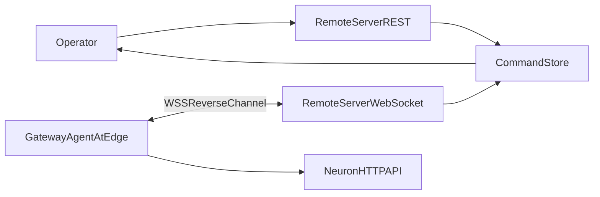

# Huong dan duy nhat: Tu dung Remote Server de ket noi voi Neuron hien tai

Tai lieu nay la 1 file standalone, muc tieu de ban co the tu tao mot Remote Control Server (REST + WebSocket reverse channel) de dieu khien Neuron dang chay, bao gom:
- thiet ke kien truc,
- contract API can co,
- protocol WebSocket can implement,
- ma khung server tham khao,
- quy trinh test end-to-end.

---

## 1) Bai toan va pham vi

Ban da co Neuron (va/hoac Neuron Dashboard) dang chay. Ban muon mot remote server ben ngoai de:
- tao `edge gateway`,
- nhan ket noi reverse-channel tu edge,
- gui command API toi Neuron thong qua edge agent,
- poll ket qua command.

Phan nay tap trung vao remote server, khong sua code core Neuron.

### 1.1 Lenh 1-buoc de nang cap Neuron an toan du lieu (miniPC)

Neu ban dang chay Neuron on dinh tren miniPC va muon nang cap ma khong mat du lieu cau hinh/hien trang, chi can chay 1 lenh tu GitHub:

```bash
curl -fsSL https://raw.githubusercontent.com/<owner>/<repo>/<branch>/scripts/upgrade-cm4-native-safe-remote.sh | \
  bash -s -- --repo https://github.com/<owner>/<repo>.git --branch main
```

Script nay tu dong:
- stop service Neuron hien tai (neu dang chay),
- backup `build-native-cm4/config` + `neuron.json`,
- pull source + build ban moi + bat lai service Neuron,
- restore lai du lieu runtime da backup.

Sau khi upgrade xong, nguoi dung vao UI Neuron (`Configuration -> Remote Control`) de tu cau hinh `gatewayId`, `controlServerUrl`, `authMode`, `heartbeatSec`, `reconnectSec`.

Neu ban muon auto setup backend-stub (khong bat buoc), bo sung:

```bash
--enable-remote-stub 1
```

---

## 2) Kien truc tong the



Y nghia:
- `RemoteServerREST`: endpoint cho operator he thong cloud.
- `RemoteServerWebSocket`: reverse-channel endpoint de edge gateway ket noi vao.
- `GatewayAgentAtEdge`: thanh phan o edge (backend stub/agent) nhan command, goi Neuron API local, tra response.
- `CommandStore`: luu trang thai command `queued/running/success/failed/timeout`.

---

## 3) Contract bat buoc phia Remote Server

Toi thieu phai co 3 REST endpoint:

1. `POST /v1/edge-gateways`
   - Tao gateway.
   - Tra bootstrap cho edge:
     - `controlServerUrl` (WSS URL),
     - `authMode` (`mtls` hoac `mtls_hmac`),
     - `heartbeatSec`,
     - `reconnectSec`,
     - `hmacSecret` (neu `mtls_hmac`).

2. `POST /v1/edge-gateways/{edgeGatewayId}/commands`
   - Day command toi edge dang online.
   - Input:
     - `commandId` (unique),
     - `operation`,
     - `neuronRequest` (method/path/query/body),
     - `timeoutMs`,
     - `idempotencyKey`,
     - `dryRun`.

3. `GET /v1/edge-gateways/{edgeGatewayId}/commands/{commandId}`
   - Poll ket qua command.
   - Output:
     - `status`,
     - `httpStatus`,
     - `result`,
     - `errorMessage`,
     - `queuedAt/startedAt/completedAt`.

Tham chieu mau request co san:
- `scripts/neuron-remote-control/openapi/edge-gateway-remote-minimal.http`

---

## 4) Protocol WebSocket reverse-channel (bat buoc)

Remote server can endpoint:
- `wss://<host>/reverse-channel`

### 4.1 Frame tu Edge -> Server
- `HELLO`
  - payload toi thieu: `gatewayId`
- `HEARTBEAT`
  - payload rong hoac metadata heartbeat
- `RESPONSE`
  - payload:
    - `commandId`
    - `status` (`success|failed|rejected|timeout`...)
    - `httpStatus`
    - `result`
    - `errorMessage`
    - `completedAt`

### 4.2 Frame tu Server -> Edge
- `HELLO_ACK`
- `PING_ACK` (tra heartbeat)
- `COMMAND`
  - payload:
    - `commandId`
    - `gatewayId`
    - `operation`
    - `neuronRequest`
    - `timeoutMs`
    - `idempotencyKey`
    - `dryRun`
    - `createdAt`

---

## 5) Rule nghiep vu bat buoc tren server

1. Edge online/offline tracking
   - Luu socket theo `gatewayId`.
   - Mat socket => danh dau offline.

2. Dispatch rule
   - Neu gateway khong ton tai => `404 NOT_FOUND`.
   - Neu gateway offline => `409 EDGE_OFFLINE`.
   - Neu `commandId` da ton tai => `409 CONFLICT`.

3. Timeout rule
   - Sau `timeoutMs`, neu command van `queued/running` => set `timeout`.

4. Idempotency rule
   - Kiem tra `idempotencyKey` theo chien luoc cua ban (khuyen nghi map theo gateway+operation+business key).

5. Security rule
   - Production bat buoc TLS verify dung.
   - Neu `mtls_hmac`, verify HMAC secret phia channel handshake (neu ap dung theo policy cua ban).

---

## 6) Ma khung Remote Server (FastAPI) de bat dau nhanh

Luu y: day la khung toi thieu de trien khai nhanh. Ban co the tach file/module theo architecture rieng.

```python
from fastapi import FastAPI, WebSocket, WebSocketDisconnect, HTTPException
import asyncio, uuid
from datetime import datetime, timezone

app = FastAPI()

def now_iso():
    return datetime.now(timezone.utc).isoformat().replace("+00:00", "Z")

edge_gateways = {}      # gatewayId -> metadata
gateway_sockets = {}    # gatewayId -> WebSocket
commands = {}           # commandId -> status doc
pending = {}            # commandId -> Future
lock = asyncio.Lock()

@app.post("/v1/edge-gateways")
async def create_gateway(req: dict):
    gw = req["edgeGatewayId"]
    async with lock:
        if gw in edge_gateways:
            raise HTTPException(status_code=409, detail={"errorCode":"CONFLICT","message":"exists"})
        edge_gateways[gw] = {"status":"offline","createdAt":now_iso(), **req}
    return {
        "edgeGatewayId": gw,
        "bootstrap": {
            "controlServerUrl": "wss://your-domain/reverse-channel",
            "authMode": req.get("authMode", "mtls"),
            "heartbeatSec": 20,
            "reconnectSec": 3
        },
        "createdAt": now_iso()
    }

@app.post("/v1/edge-gateways/{gateway_id}/commands")
async def dispatch(gateway_id: str, req: dict):
    cmd_id = req["commandId"]
    async with lock:
        if gateway_id not in edge_gateways:
            raise HTTPException(status_code=404, detail={"errorCode":"NOT_FOUND","message":"gateway not found"})
        if cmd_id in commands:
            raise HTTPException(status_code=409, detail={"errorCode":"CONFLICT","message":"command exists"})
        ws = gateway_sockets.get(gateway_id)
        if ws is None:
            raise HTTPException(status_code=409, detail={"errorCode":"EDGE_OFFLINE","message":"gateway offline"})
        commands[cmd_id] = {
            "edgeGatewayId": gateway_id,
            "commandId": cmd_id,
            "status": "queued",
            "queuedAt": now_iso(),
            "request": req
        }
        pending[cmd_id] = asyncio.get_running_loop().create_future()

    await ws.send_json({"type":"COMMAND","payload":{"gatewayId":gateway_id, **req, "createdAt":now_iso()}})
    async with lock:
        commands[cmd_id]["status"] = "running"
        commands[cmd_id]["startedAt"] = now_iso()

    asyncio.create_task(timeout_watch(cmd_id, int(req.get("timeoutMs", 10000))))
    return {"edgeGatewayId":gateway_id, "commandId":cmd_id, "status":"queued", "queuedAt":commands[cmd_id]["queuedAt"]}

@app.get("/v1/edge-gateways/{gateway_id}/commands/{command_id}")
async def get_command(gateway_id: str, command_id: str):
    async with lock:
        cmd = commands.get(command_id)
        if not cmd or cmd.get("edgeGatewayId") != gateway_id:
            raise HTTPException(status_code=404, detail={"errorCode":"NOT_FOUND","message":"command not found"})
        return {
            "edgeGatewayId": cmd["edgeGatewayId"],
            "commandId": cmd["commandId"],
            "status": cmd["status"],
            "httpStatus": cmd.get("httpStatus"),
            "result": cmd.get("result"),
            "errorMessage": cmd.get("errorMessage"),
            "queuedAt": cmd.get("queuedAt"),
            "startedAt": cmd.get("startedAt"),
            "completedAt": cmd.get("completedAt")
        }

@app.websocket("/reverse-channel")
async def reverse_channel(ws: WebSocket):
    await ws.accept()
    gateway_id = None
    try:
        while True:
            frame = await ws.receive_json()
            msg_type = frame.get("type")
            payload = frame.get("payload", {})
            if msg_type == "HELLO":
                gateway_id = payload.get("gatewayId")
                if not gateway_id:
                    await ws.close(code=1008)
                    return
                async with lock:
                    gateway_sockets[gateway_id] = ws
                    edge_gateways.setdefault(gateway_id, {"edgeGatewayId":gateway_id})
                    edge_gateways[gateway_id]["status"] = "online"
                    edge_gateways[gateway_id]["lastSeenAt"] = now_iso()
                await ws.send_json({"type":"HELLO_ACK","payload":{"serverTime":now_iso()}})
            elif msg_type == "HEARTBEAT":
                async with lock:
                    if gateway_id in edge_gateways:
                        edge_gateways[gateway_id]["lastSeenAt"] = now_iso()
                await ws.send_json({"type":"PING_ACK","payload":{}})
            elif msg_type == "RESPONSE":
                await handle_response(payload)
    except WebSocketDisconnect:
        pass
    finally:
        async with lock:
            if gateway_id and gateway_sockets.get(gateway_id) is ws:
                gateway_sockets.pop(gateway_id, None)
                if gateway_id in edge_gateways:
                    edge_gateways[gateway_id]["status"] = "offline"
                    edge_gateways[gateway_id]["lastSeenAt"] = now_iso()

async def handle_response(payload: dict):
    cmd_id = payload.get("commandId")
    if not cmd_id:
        return
    async with lock:
        cmd = commands.get(cmd_id)
        if cmd:
            cmd["status"] = payload.get("status", cmd["status"])
            cmd["httpStatus"] = payload.get("httpStatus")
            cmd["result"] = payload.get("result")
            cmd["errorMessage"] = payload.get("errorMessage")
            cmd["completedAt"] = payload.get("completedAt", now_iso())
        fut = pending.pop(cmd_id, None)
        if fut and not fut.done():
            fut.set_result(True)

async def timeout_watch(cmd_id: str, timeout_ms: int):
    await asyncio.sleep(timeout_ms / 1000.0)
    async with lock:
        fut = pending.pop(cmd_id, None)
        cmd = commands.get(cmd_id)
        if fut and not fut.done():
            fut.set_result(False)
        if cmd and cmd.get("status") in {"queued", "running"}:
            cmd["status"] = "timeout"
            cmd["errorMessage"] = "command timeout"
            cmd["completedAt"] = now_iso()
```

---

## 7) Huong dan ket noi voi Neuron hien tai

## B1. Chay remote server

Vi du:
```bash
uvicorn app.main:app --host 0.0.0.0 --port 9010
```

Neu dung TLS cho demo:
- dat reverse channel URL la `wss://<host>:9010/reverse-channel`
- cap cert hop le cho client edge tin tuong.

## B2. Tao gateway tren remote server

```http
POST https://<host>:9010/v1/edge-gateways
Content-Type: application/json

{
  "edgeGatewayId": "gw_demo_001",
  "siteCode": "QN-WTP-01",
  "displayName": "MiniPC Demo 01",
  "authMode": "mtls"
}
```

Lay bootstrap tra ve de cau hinh phia Neuron/Dashboard.

## B3. Cau hinh tren Neuron Dashboard

Menu: `Configuration -> Remote Control`
- `gatewayId` = `gw_demo_001`
- `controlServerUrl` = `wss://<host>:9010/reverse-channel`
- `authMode` + `hmacSecret` (neu `mtls_hmac`)
- `heartbeatSec`, `reconnectSec`

Nhan:
1. Save
2. Test Connection
3. Connect

## B4. Dispatch lenh va poll

Dispatch:
```http
POST https://<host>:9010/v1/edge-gateways/gw_demo_001/commands
Content-Type: application/json

{
  "commandId": "cmd_get_groups_20260424_001",
  "operation": "get_groups",
  "neuronRequest": {
    "method": "GET",
    "path": "/api/v2/group"
  },
  "timeoutMs": 10000,
  "idempotencyKey": "gw_demo_001:get_groups:20260424:001",
  "dryRun": false
}
```

Poll:
```http
GET https://<host>:9010/v1/edge-gateways/gw_demo_001/commands/cmd_get_groups_20260424_001
```

---

## 8) Checklist bat buoc de len production

- [ ] Khong hardcode `controlServerUrl`; lay theo env/config.
- [ ] Bat TLS verify day du (khong insecure mode).
- [ ] RBAC cho API tao gateway/dispatch/poll.
- [ ] Audit log day du cho tao gateway, dispatch, response, timeout.
- [ ] Persist command/gateway vao DB (khong chi in-memory).
- [ ] Co co che reconnect/backoff va stale socket cleanup.
- [ ] Co metrics/alert cho `EDGE_OFFLINE`, `TIMEOUT`, ty le fail command.

---

## 9) Loi thuong gap va cach sua nhanh

- `EDGE_OFFLINE` khi dispatch:
  - Edge chua connect hoac rot WS.
  - Kiem tra trang thai channel va heartbeat.

- `INVALID_CONFIG` khi test connection:
  - `controlServerUrl` khong dung `wss://` hoac thieu `gatewayId`.

- `TLS_FAILED`:
  - Sai cert/CA/hostname.
  - Can cap lai cert dung CN/SAN.

- Command bi `timeout`:
  - `timeoutMs` qua ngan hoac Neuron API response cham.
  - Tang `timeoutMs`, toi uu lenh, kiem tra network edge.

---

## 10) File tham chieu trong repo hien tai

- `scripts/neuron-remote-control/remote-server/app/main.py`
- `scripts/neuron-remote-control/openapi/edge-gateway-remote-minimal.http`
- `scripts/neuron-remote-control/openapi/neuron-local-remote-bootstrap.openapi.yaml`
- `neuron-dashboard/src/views/config/remoteControl/Index.vue`
- `neuron-dashboard/src/api/remoteControl.ts`

Neu ban can implementation "san xuat duoc ngay", co the bat dau tu file remote-server tham chieu ben tren, sau do nang cap dan theo checklist production o Section 8.
