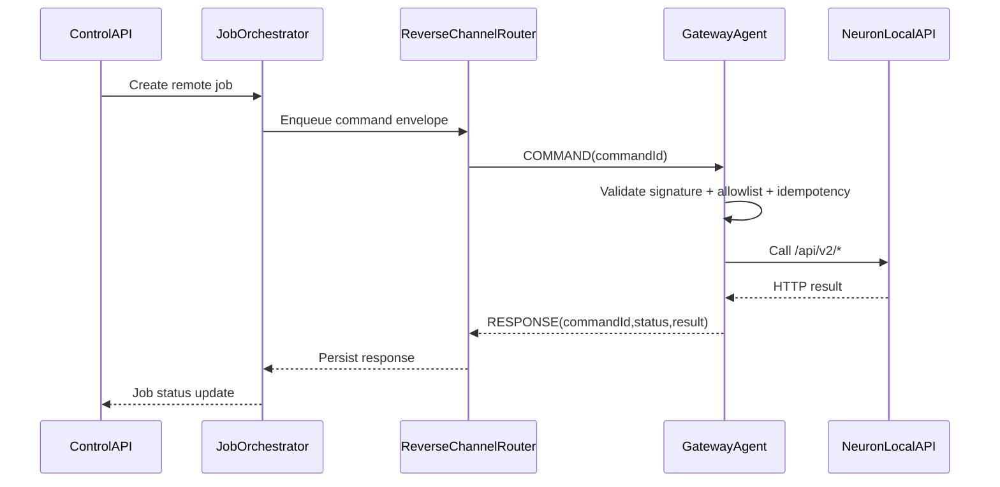

# GatewayAgent and ReverseChannelRouter Design

## Scope

This document describes session lifecycle, routing, timeout, and retry behavior for reverse-channel execution when Neuron is behind NAT.

## Components

- **ControlAPI**: receives operator/API requests and creates remote jobs.
- **JobOrchestrator**: persists jobs, emits commands, tracks retries and timeout.
- **ReverseChannelRouter**: holds active gateway sessions and forwards command frames.
- **GatewayAgent**: persistent outbound client that validates and executes commands against local Neuron REST API.

## Session Lifecycle

1. GatewayAgent connects via mTLS over WSS to Router.
2. Agent sends `HELLO` frame with `gatewayId`, `agentVersion`, `policyVersion`, `capabilities`.
3. Router validates certificate identity and binds one active session per `gatewayId`.
4. Router returns `SESSION_ACK` with heartbeat interval and server time.
5. Agent sends heartbeat every `N` seconds; router marks offline after `3x` missed heartbeats.

## Command Flow

## Timeout and Retry

- `timeoutMs` is defined per command and enforced by both orchestrator and agent.
- Router delivery timeout (no ACK from agent): mark attempt as failed and retry.
- Agent execution timeout: stop request and return `status=timeout`.
- Retry policy defaults:
  - max attempts: 3
  - backoff: exponential with jitter (`1s`, `2s`, `4s` + random 0-250ms)
  - retry only for transport timeout/temporary errors.
- No retry for explicit validation rejection (allowlist/signature/RBAC failures).

## Idempotency

- Orchestrator enforces unique tuple `(gatewayId, idempotencyKey)` for active window.
- Agent keeps local LRU cache of recent idempotency keys (`>=24h`).
- Duplicate command returns previous result with `status=success` and `attempt` unchanged.

## Failure Modes

- **Gateway offline**: command remains queued until TTL expires.
- **Session replaced**: older session revoked, in-flight commands re-queued.
- **Neuron auth expired**: agent refreshes local token and retries once.
- **Router restart**: session recovery occurs through agent reconnect and replay-safe job store.

## Observability

- Metrics: online gateways, command latency, success rate, timeout rate, retry count.
- Structured logs include `gatewayId`, `commandId`, `traceId`, `operation`.
- Distributed trace from ControlAPI to agent call via `traceId` propagation.
