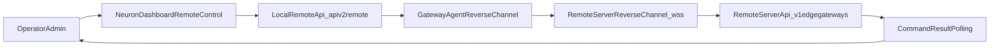

# SOP Remote Control End-to-End (Dashboard + Backend Stub + Remote Server)

## 1) Muc dich va pham vi

Tai lieu nay mo ta quy trinh van hanh chuan de:
- tao ket noi remote control tu Dashboard xuong Neuron backend stub,
- kiem tra ket noi,
- bat/tat reverse channel,
- gui lenh lay thong so va theo doi ket qua,
- xu ly su co van hanh thuong gap.

Pham vi:
- Dashboard route `Configuration -> Remote Control`.
- Local API: `/api/v2/remote/*` (Neuron local bootstrap API).
- Remote control server API: `/v1/edge-gateways/*`.

Khong bao gom:
- Chi tiet implementation noi bo cua plugin.
- Quy trinh cap phat chung chi mTLS theo PKI doanh nghiep (chi de cap checklist).

## 2) Kien truc luong nghiep vu



Y nghia 2 tang API:
- Tang 1 (local): Dashboard luu profile, test, connect/disconnect, xem status.
- Tang 2 (remote): server dieu phoi command toi edge gateway va tra ket qua.

## 3) Nguon su that ky thuat

- Local OpenAPI: `scripts/neuron-remote-control/openapi/neuron-local-remote-bootstrap.openapi.yaml`
- Remote API samples: `scripts/neuron-remote-control/openapi/edge-gateway-remote-minimal.http`
- Dashboard remote page: `neuron-dashboard/src/views/config/remoteControl/Index.vue`
- Dashboard API wrapper: `neuron-dashboard/src/api/remoteControl.ts`
- Backend stub app: `scripts/neuron-remote-control/backend-stub/app/main.py`
- Remote server app: `scripts/neuron-remote-control/remote-server/app/main.py`

## 4) Dieu kien tien quyet

### 4.1 Moi truong va quyen
- Quyen admin de thao tac Dashboard va local API.
- Neuron API local san sang (thuong tai `http://127.0.0.1:7000`).
- Network outbound cho phep edge ket noi den `wss://<control-server>/reverse-channel`.

### 4.2 Bien va tham so can xac nhan
- `gatewayId`: unique, toi thieu 3 ky tu.
- `controlServerUrl`: bat buoc bat dau bang `wss://`.
- `authMode`: `mtls` hoac `mtls_hmac`.
- `hmacSecret`: bat buoc neu `authMode = mtls_hmac`.
- `heartbeatSec`: khuyen nghi 20 (range 5..120).
- `reconnectSec`: khuyen nghi 3 (range 1..60).

### 4.3 Luu y demo/lab
- Remote server demo dung cert self-signed, REST test co the can `-k`.
- Tuyet doi khong giu che do bo qua xac thuc TLS trong production.

## 5) Quy trinh van hanh chuan

## Buoc A - Tao Edge Gateway tren remote server

Muc tieu: tao doi tuong gateway va nhan bootstrap mapping.

Vi du:
```http
POST https://localhost:9010/v1/edge-gateways
Content-Type: application/json

{
  "edgeGatewayId": "gw_demo_001",
  "siteCode": "QN-WTP-01",
  "displayName": "MiniPC Demo 01",
  "authMode": "mtls"
}
```

Tieu chi pass:
- HTTP 200.
- Tra ve `bootstrap.controlServerUrl`, `authMode`, `heartbeatSec`, `reconnectSec`.
- Neu `authMode = mtls_hmac` thi co `bootstrap.hmacSecret`.

## Buoc B - Cau hinh profile tren Dashboard

Vao `Configuration -> Remote Control` va nhap:
- Gateway ID.
- Control Server URL.
- Auth mode (+ HMAC secret neu can).
- Heartbeat/Reconnect.
- Dry-run default (tuy nghiep vu).

Nhan `Save`.

Local API tuong ung:
```http
PUT /api/v2/remote/connection
Content-Type: application/json

{
  "gatewayId": "gw_demo_001",
  "controlServerUrl": "wss://control.example.com/reverse-channel",
  "authMode": "mtls_hmac",
  "hmacSecret": "replace-me",
  "heartbeatSec": 20,
  "reconnectSec": 3,
  "dryRunDefault": true
}
```

Tieu chi pass:
- API tra `error = 0`.
- Profile load lai duoc qua `GET /api/v2/remote/connection`.

## Buoc C - Test connection truoc khi connect that

Nhan `Test Connection` tren UI hoac goi API:
```http
POST /api/v2/remote/connection/test
Content-Type: application/json

{
  "gatewayId": "gw_demo_001",
  "controlServerUrl": "wss://control.example.com/reverse-channel",
  "authMode": "mtls",
  "hmacSecret": ""
}
```

Ket qua mong doi:
- `ok = true`
- `code = CONNECTED`
- Co `checkedAt`, co the co `latencyMs`.

Neu fail:
- Doc `code` va vao muc runbook tai Section 8.

## Buoc D - Bat reverse channel

Nhan `Connect` tren UI hoac goi:
```http
POST /api/v2/remote/connection/connect
```

Theo doi runtime:
```http
GET /api/v2/remote/connection/status
```

Tieu chi pass:
- `state` chuyen sang `connecting` roi `connected`.
- `lastHeartbeatAt` duoc cap nhat theo chu ky.

## Buoc E - Gui lenh lay thong so va poll ket qua

### E1 - Dispatch command (remote server)
```http
POST https://localhost:9010/v1/edge-gateways/gw_demo_001/commands
Content-Type: application/json

{
  "commandId": "cmd_get_groups_20260424_001",
  "operation": "get_groups",
  "neuronRequest": {
    "method": "GET",
    "path": "/api/v2/group"
  },
  "timeoutMs": 10000,
  "idempotencyKey": "gw_demo_001:get_groups:20260424:001",
  "dryRun": false
}
```

### E2 - Poll command result
```http
GET https://localhost:9010/v1/edge-gateways/gw_demo_001/commands/cmd_get_groups_20260424_001
```

Tieu chi pass:
- `status` ket thuc o `success`.
- Co `httpStatus`, `result`, `completedAt`.

### E3 - Vi du lay tag theo node/group
```http
POST https://localhost:9010/v1/edge-gateways/gw_demo_001/commands
Content-Type: application/json

{
  "commandId": "cmd_get_tags_20260424_001",
  "operation": "get_tags",
  "neuronRequest": {
    "method": "GET",
    "path": "/api/v2/tags",
    "query": {
      "node": "BL1_1",
      "group": "TSC"
    }
  },
  "timeoutMs": 10000,
  "idempotencyKey": "gw_demo_001:get_tags:20260424:001",
  "dryRun": false
}
```

## Buoc F - Disconnect an toan

Dung truoc khi bao tri/rollback:
```http
POST /api/v2/remote/connection/disconnect
```

Tieu chi pass:
- API tra `status = disconnected`.
- `GET /api/v2/remote/connection/status` ve `disconnected` hoac `disabled`.

## 6) API Contract tom tat

### 6.1 Local API (Dashboard su dung)
- `GET /api/v2/remote/connection`
- `PUT /api/v2/remote/connection`
- `POST /api/v2/remote/connection/test`
- `POST /api/v2/remote/connection/connect`
- `POST /api/v2/remote/connection/disconnect`
- `GET /api/v2/remote/connection/status`

Enum quan trong:
- `authMode`: `mtls | mtls_hmac`
- test `code`: `CONNECTED | TLS_FAILED | AUTH_FAILED | TIMEOUT | ROUTER_NO_ACK | INVALID_CONFIG`
- runtime `state`: `disabled | connecting | connected | degraded | disconnected`

### 6.2 Remote server API
- `POST /v1/edge-gateways`
- `POST /v1/edge-gateways/{edgeGatewayId}/commands`
- `GET /v1/edge-gateways/{edgeGatewayId}/commands/{commandId}`

## 7) Runbook su co thuong gap

| Trieu chung | Nguyen nhan thuong gap | Cach kiem tra nhanh | Cach xu ly |
|---|---|---|---|
| `INVALID_CONFIG` khi test | Sai `wss://`, thieu `gatewayId`, thieu `hmacSecret` | Kiem tra payload test/save | Sua lai profile theo constraint |
| `TLS_FAILED` | Cert/CA khong hop le, host mismatch | Test handshake TLS, kiem tra cert chain | Cap nhat cert/CA dung chuan |
| `AUTH_FAILED` | Sai token/HMAC hoac policy | Kiem tra secret da luu va mode auth | Dong bo lai secret va auth mode |
| `ROUTER_NO_ACK` | Reverse channel khong ACK | Xem log edge va remote server | Kiem tra route, firewall, ws path |
| `TIMEOUT` | Command qua han hoac edge phan hoi cham | Kiem tra `timeoutMs`, tai edge | Tang timeout hop ly, toi uu lenh |
| `EDGE_OFFLINE` khi dispatch | Chua connect hoac da rot ket noi | Xem `status` local va online state remote | Connect lai, xac nhan heartbeat |
| runtime `degraded` | Heartbeat gian doan, loi mang tam thoi | Kiem tra `lastHeartbeatAt` | Khoi dong lai ket noi, theo doi on dinh |

## 8) Security va compliance checklist

- Khong log plaintext `hmacSecret` hoac token.
- Bat buoc TLS hop le trong production (khong bo qua verify).
- Gioi han quyen admin cho endpoint `/api/v2/remote/*`.
- Luu audit event toi thieu cho: save profile, test, connect, disconnect, dispatch command.
- Dinh ky rotate secret/chung chi theo chinh sach noi bo.
- Dam bao `commandId` va `idempotencyKey` theo convention de truy vet.

## 9) Acceptance checklist truoc go-live

- [ ] Da tao edge gateway va nhan bootstrap hop le.
- [ ] Save profile thanh cong tren Dashboard.
- [ ] Test connection tra `CONNECTED`.
- [ ] Connect thanh cong, state vao `connected`.
- [ ] Dispatch toi thieu 2 lenh mau (`get_groups`, `get_tags`) va nhan ket qua `success`.
- [ ] Disconnect/Connect lai thanh cong (kiem thu rollback).
- [ ] Da xac nhan secret handling, RBAC, va audit logs.

## 10) Phu luc thao tac nhanh (demo/lab)

### Demo bang docker compose
```bash
docker compose -f scripts/neuron-remote-control/demo/docker-compose.yml up -d --build
```

Tat demo:
```bash
docker compose -f scripts/neuron-remote-control/demo/docker-compose.yml down
```

### Chay local service Python (khong Docker)
```bash
python3 -m pip install -r scripts/neuron-remote-control/remote-server/requirements.txt
uvicorn app.main:app --app-dir scripts/neuron-remote-control/remote-server --host 0.0.0.0 --port 9010
```

```bash
python3 -m pip install -r scripts/neuron-remote-control/backend-stub/requirements.txt
PYTHONPATH=. uvicorn app.main:app --app-dir scripts/neuron-remote-control/backend-stub --host 0.0.0.0 --port 18080
```
