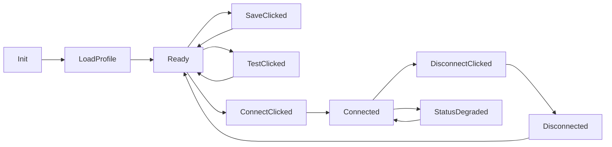

# Neuron UI Integration Contract for `/api/v2/remote/*`

This document defines the frontend contract to integrate Neuron web UI with remote-control bootstrap endpoints.

## Target Screen

- Menu path: `Configuration -> Remote Control`
- One page with:
  - **Connection Profile Form**
  - **Action Buttons**
  - **Runtime Status Panel**
  - **Last Test Result Panel**

## API Endpoints Used by UI

- `GET /api/v2/remote/connection`
- `PUT /api/v2/remote/connection`
- `POST /api/v2/remote/connection/test`
- `POST /api/v2/remote/connection/connect`
- `POST /api/v2/remote/connection/disconnect`
- `GET /api/v2/remote/connection/status`

## Form Model (UI)

```ts
type RemoteConnectionForm = {
  gatewayId: string
  controlServerUrl: string
  authMode: "mtls" | "mtls_hmac"
  hmacSecret: string
  heartbeatSec: number
  reconnectSec: number
  dryRunDefault: boolean
  enabled: boolean
}
```

## UI Validation Rules (before calling API)

- `gatewayId`: required, length 3-128
- `controlServerUrl`: required, must start with `wss://`
- `authMode`: required (`mtls` or `mtls_hmac`)
- `hmacSecret`: required only when `authMode == mtls_hmac`
- `heartbeatSec`: range `5..120`
- `reconnectSec`: range `1..60`

## Runtime Status Contract

Map API `state` to UI badge:

- `disabled` -> gray
- `connecting` -> blue
- `connected` -> green
- `degraded` -> yellow/orange
- `disconnected` -> gray/red

Display extra fields:

- `lastHeartbeatAt` (if present)
- `lastError` (if present)
- `lastChangeAt` (always)

## Button Behavior

- `Save`:
  - validate form client-side
  - call `PUT /api/v2/remote/connection`
  - success toast: `Saved`
  - error toast: `errorCode/message`

- `Test Connection`:
  - call `POST /api/v2/remote/connection/test` with current form values
  - do not force save
  - show result card: `ok`, `code`, `message`, `latencyMs`

- `Connect`:
  - call `POST /api/v2/remote/connection/connect`
  - then refresh `status`

- `Disconnect`:
  - call `POST /api/v2/remote/connection/disconnect`
  - then refresh `status`

## Polling Strategy

- Poll `GET /api/v2/remote/connection/status` every 5 seconds while page is open.
- Stop polling when page unmounts.
- Backoff to 10 seconds when tab is hidden.

## Page Initialization Flow

1. `GET /api/v2/remote/connection` -> initialize form
2. `GET /api/v2/remote/connection/status` -> initialize badge
3. start polling status loop

## Error Handling Contract

Server 4xx/5xx error payload expected:

```json
{
  "errorCode": "SOME_CODE",
  "message": "Human readable reason"
}
```

UI handling:

- Always show toast with `message`
- Keep form values unchanged on failed save
- For failed connect/test, keep test/status panel visible for troubleshooting

## Frontend State Machine



## Minimal Frontend Service Interface

```ts
interface RemoteControlApi {
  getConnection(): Promise<ConnectionProfile>
  saveConnection(payload: ConnectionProfileSaveRequest): Promise<{ error: number; updatedAt: string }>
  testConnection(payload: ConnectionTestRequest): Promise<ConnectionTestResult>
  connect(): Promise<{ error: number; status: "connecting" | "connected" | "failed"; message: string }>
  disconnect(): Promise<{ error: number; status: "disconnected"; message: string }>
  getStatus(): Promise<ConnectionRuntimeStatus>
}
```

## Security UX Requirements

- Render `hmacSecret` as password field.
- Never prefill `hmacSecret` from server response.
- Hide secret value from logs and UI debug panel.
- Restrict page to admin role in Neuron UI.

